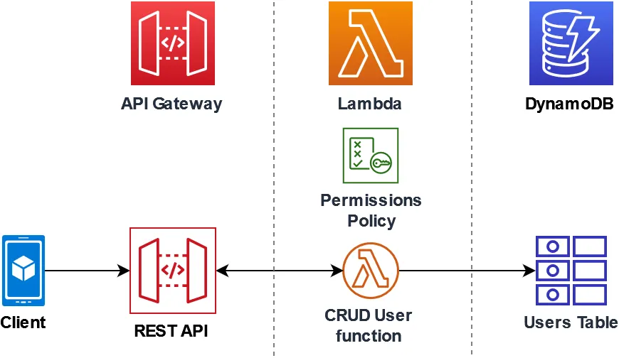
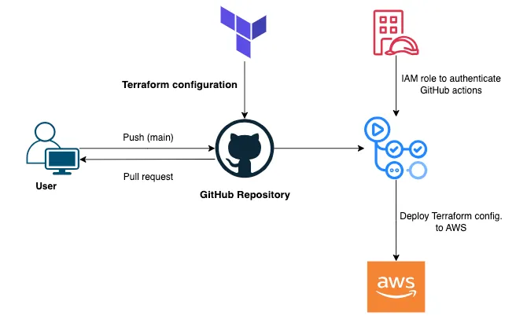

# UNASP Workshop — Visão Geral do Projeto

Este repositório contém um projeto de exemplo para um workshop: uma aplicação frontend Angular (com suporte a SSR), uma função AWS Lambda que interage com DynamoDB e infraestrutura definida em Terraform.



## O que há neste repositório

- `frontend/` — Aplicação Angular (v19) com configuração para SSR (server-side rendering) usando `@angular/ssr` e um servidor Express.
	- `package.json` — scripts e dependências (scripts importantes: `start`, `build`, `serve:ssr:unasp-workshop-app`).
	- `angular.json` — configurações de build, incluindo saída `browser` e `server` para SSR.
	- `src/` — código fonte do app Angular.
		- `src/app/app.component.ts` — componente principal; implementa UI para listar, criar, alterar e deletar itens em uma tabela DynamoDB via uma API.
		- `src/app/app.config.ts` e `app.config.server.ts` — configuração de bootstrap (cliente e servidor).
		- `src/server.ts` — servidor Express usado para servir os assets `browser` e renderizar SSR.
		- `src/main.ts` e `src/main.server.ts` — pontos de entrada do app (navegador e servidor).
	- `public/` — arquivos estáticos a serem copiados para o build.

- `lambda/` — código da função Lambda (Python).
	- `lambda_function.py` — handler que processa requisições do API Gateway e interage com DynamoDB (usa boto3). Implementa GET/POST/PUT/DELETE e já contém tratamento básico de CORS e decodificação de body em base64 quando necessário.

- `infra/` — configurações Terraform para criar os recursos AWS necessários.
	- `infra_backend.tf` — cria recursos como tabela DynamoDB, função Lambda, API Gateway (HTTP), permissões e outputs; contém placeholders para credenciais e para o caminho do pacote da lambda (`../lambda_function.zip`).
	- `infra_front.tf` — configurações de bucket S3 para hospedar o frontend como site estático, política pública e upload do `index.html`.

## Tecnologias principais

- Frontend: Angular 19 (standalone components), TypeScript, Tailwind-like classes no template (estilo utilitário), SSR com `@angular/ssr`.
- Backend (server de SSR): Node + Express (arquivo `src/server.ts`).
- Função serverless: AWS Lambda (Python, `boto3`) para CRUD em DynamoDB.
- Infraestrutura: Terraform (AWS provider) para DynamoDB, Lambda, API Gateway e S3 (hospedagem estática).

## Pontos importantes identificados no código

- O `app.component.ts` faz chamadas HTTP para uma URL do API Gateway (variável `apiUrl` hard-coded no componente). Substitua essa URL pela URL produzida pelo Terraform (output `api_gateway_url`) após deploy.
- O Lambda faz parsing do `event` e tenta suportar tanto o formato HTTP v2 (`requestContext.http.method`) quanto o v1 (`httpMethod`) do API Gateway. Também lida com bodies em base64.
- Os arquivos Terraform contêm placeholders de `access_key` e `secret_key` em `provider "aws"` — não deixe credenciais hard-coded em produção; prefira perfis, variáveis de ambiente ou AWS SSO/roles.
- `infra/infra_backend.tf` referencia `filename = "../lambda_function.zip"` — é necessário gerar esse zip antes do deploy.

## Como rodar localmente (resumo)

Requisitos mínimos: Node.js (18+ recomendado), npm, Angular CLI (instalado localmente via devDependencies) e Python 3.x para a Lambda (se quiser testá-la localmente).

1) Frontend (modo desenvolvimento):

```powershell
cd frontend
npm install
npm start
```

Isso inicia o dev-server do Angular (hot reload) em modo `development` (conforme `angular.json` / script `start`).

2) Frontend (SSR produção básica):

```powershell
cd frontend
npm install
# Build do browser e server (com configurações do angular.json)
ng build --configuration production
ng run unasp-workshop-app:server:production
# Em seguida iniciar o servidor SSR (script disponível):
node dist/unasp-workshop-app/server/server.mjs
```

Obs.: os comandos de build/SSR podem exigir ajustes dependendo da versão do Angular CLI; o `package.json` já inclui um script `serve:ssr:unasp-workshop-app` que executa o `server.mjs` gerado.

3) Lambda local / testes:

- O arquivo `lambda/lambda_function.py` usa `boto3`; para testar localmente sem deploy, configure credenciais AWS (via `aws configure`) e execute testes unitários ou um pequeno runner que construa um evento de API Gateway.
- Para deploy, crie o ZIP da função (conforme `infra_backend.tf` referência) e use `terraform apply` dentro de `infra/` (ver observações abaixo).

4) Infra (Terraform):



```powershell
cd infra
# Ajuste provider (use profiles ou variáveis de ambiente em vez de colocar chaves no arquivo)
# Gere lambda_function.zip na pasta correta (ou atualize o caminho no TF)
terraform init
terraform apply
```

## Segurança e configurações a ajustar

- Nunca deixar `access_key` e `secret_key` em arquivos versionados. Use variáveis de ambiente, `~/.aws/credentials` ou IAM roles.
- Revise as políticas de CORS e de bucket S3 antes de tornar recursos públicos.
- Para produção, considere usar um deployment pipeline que faça o build do frontend, gere o artefato da lambda e rode `terraform apply` de forma automatizada.

## Próximos passos sugeridos

1. Definir a forma de deploy automatizado (GitHub Actions, AWS CodePipeline) que: builda o frontend, empacota a lambda e aplica Terraform.
2. Criar um script para gerar `lambda_function.zip` automaticamente (incluindo dependências, se houver bibliotecas externas).
3. Mover as credenciais AWS para variáveis/secret manager e remover placeholders do TF.
4. Adicionar um pequeno README dentro de `frontend/` com comandos específicos de desenvolvimento e notes sobre SSR.
5. Adicionar testes unitários básicos para o Lambda e para o frontend.

## Arquivos de referência / onde olhar primeiro

- `frontend/src/app/app.component.ts` — comportamento principal do app (UI + chamadas à API).
- `lambda/lambda_function.py` — lógica de backend (CRUD no DynamoDB).
- `infra/infra_backend.tf` e `infra/infra_front.tf` — infraestrutura.
- `frontend/src/server.ts` — servidor Express para SSR.

---

Se quiser, eu posso:
- acrescentar um README mais detalhado dentro de `frontend/` com comandos de desenvolvimento passo-a-passo;
- adicionar um script para empacotar a lambda e atualizar o Terraform;
- ou abrir um PR com pequenas melhorias (ex.: variáveis para provider AWS).

Diga qual desses você prefere que eu faça a seguir.

